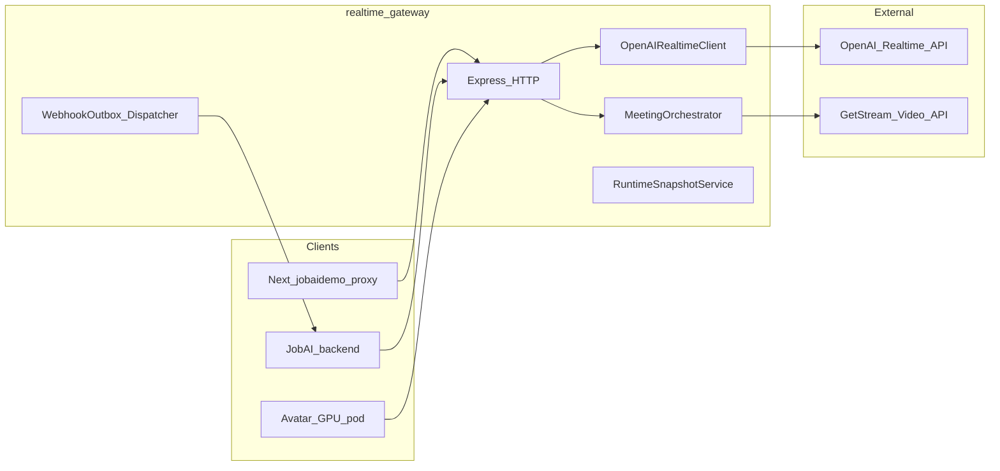
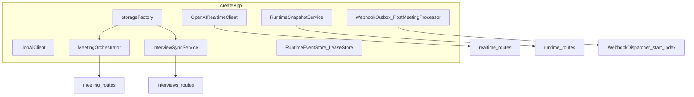
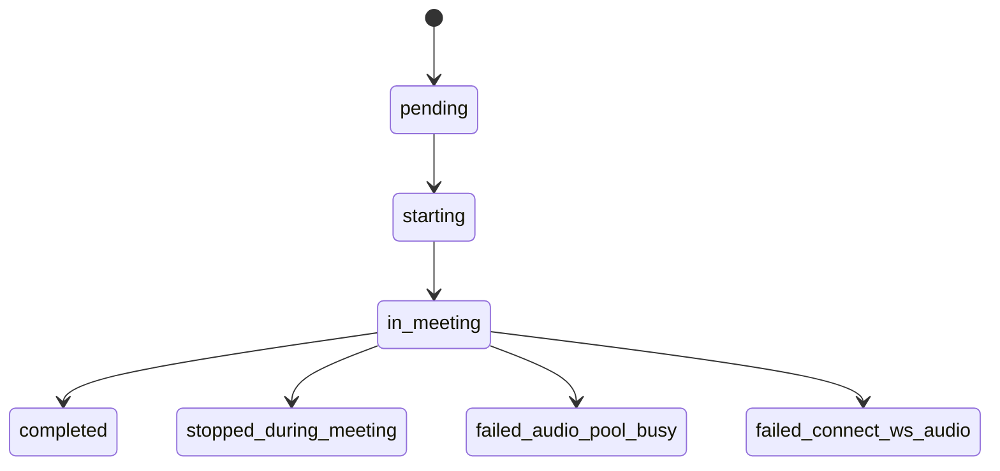

# NULLXES HR AI — архитектура `realtime-gateway`

Сервис **Node.js + Express + TypeScript** (`backend/realtime-gateway`): оркестрация встреч, прокси к OpenAI Realtime, runtime-снимки и события, интеграция с JobAI, выдача signed join-ссылок, опционально — аватар-под (RunPod) и Stream (запись / провижининг). Этот документ — карта «от NULLXES до процессов и внешних API».

---

## 1. Место в стеке

Типичный путь фронта: браузер → `GET/POST /api/gateway/...` на Next → **тот же путь** на gateway (`BACKEND_GATEWAY_URL`). Allowlist путей задаётся на стороне Next (`frontend/jobaidemo`).

---

## 2. Точка сборки приложения

Файл: `src/app.ts` — функция `createApp()`:

1. **`createStorageBackends()`** (`services/storageFactory.ts`) — `memory` или `redis`: сессии OpenAI, встречи, интервью, join-token audit/revoke.
2. Клиенты: **`OpenAIRealtimeClient`**, **`JobAiClient`**, **`InterviewSyncService`**, **`MeetingOrchestrator`** (+ опционально **`AvatarClient`**, **`StreamProvisioner`**, **`StreamRecordingService`**).
3. **Runtime**: `RuntimeEventStore`, `RuntimeLeaseStore`, `RuntimeSnapshotService` (агрегирует meeting/session/interview/avatar/stream).
4. **Webhooks**: `WebhookOutbox` (Redis или in-memory загрузка), `WebhookDispatcher`, `PostMeetingProcessor`.
5. Подключение роутеров и middleware (CORS, `requestId`, `pino-http`, rate limits, metrics, health).

---

## 3. Монтирование HTTP-маршрутов

Префиксы задаются в `app.use(...)`:

| Префикс | Роутер | Назначение |
|---------|--------|------------|
| `/health`, `/health/ready` | inline + `middleware/health` | Liveness / readiness (Redis, OpenAI key). |
| `/metrics` | optional | Prometheus при `METRICS_ENABLED`. |
| `/artifacts` | `express.static` | Раздача артефактов пост-обработки (`ARTIFACTS_DIR`). |
| `/realtime` | `realtime.routes` | SDP-сессия, ephemeral token, события DataChannel, закрытие сессии. |
| `/meetings` | `meeting.routes` | Старт/стоп/fail встречи, admission кандидата, запись Stream, голос OpenAI. |
| `/interviews` | `joinLinks.routes` (если `JOIN_TOKEN_SECRET`) | **Раньше** generic `interviews`: выдача/отзыв/audit join-ссылок (`/:jobAiId/links/*`). |
| `/join` | `joinLinks.routes` (public) | Верификация JWT, session-ticket для наблюдателя. |
| `/interviews` | `interviews.routes` | Список/деталь интервью, статус, session-link, sync с JobAI. |
| `/api/v1` | `tzAlias.routes` | Алиас под ожидаемый JobAI-путь (`questions/general` и др.). |
| `/runtime` | `runtime.routes` | Снимок по `meetingId` / `jobAiId`, SSE/поллинг событий, команды runtime, stream binding. |
| `/avatar` | `avatar.routes` | События от пода, health/state по `meetingId`. |
| `/` (корень) | `jobai.routes` | Webhooks и ingest от JobAI (`/webhooks/jobai/*`, `/jobai/sync`, …). |
| `/ops/webhooks` | inline | Статистика очереди исходящих webhooks. |

Порядок важен: при включённых join-links роутер выдачи монтируется **до** общего `interviews`, чтобы `POST .../links/candidate` не перехватывался как `:id`.

---

## 4. Жизненный цикл встречи (meetings)

Ядро: **`MeetingOrchestrator`** + **`MeetingStateMachine`** + **`InMemoryMeetingStore`** / **`PersistedMeetingStore`**.

Состояния (упрощённо): `pending` → `starting` → `in_meeting` → терминалы (`completed`, `stopped_during_meeting`, `failed_*`).

При **`startMeeting`**:

- создаётся запись встречи, переходы валидируются state machine;
- **fire-and-forget** kickoff аватара (если настроен `AvatarClient` + Stream keys) — встреча считается начатой даже если под медленный;
- при наличии **`StreamRecordingService`** — best-effort автостарт записи с ретраями.

Исходящие уведомления в JobAI: **`WebhookOutbox`** кладёт события (например `meeting.status.changed`); **`WebhookDispatcher`** (из `index.ts`) периодически доставляет с подписью (`webhookSigner`).

---

## 5. OpenAI Realtime (`/realtime`)

Файл: `routes/realtime.routes.ts`, сервис: `openaiRealtimeClient.ts`, состояние сессий: **`sessionStore`**.

- **`POST /realtime/session`** — SDP offer → upstream OpenAI unified realtime → SDP answer + заголовок `x-session-id`.
- **`GET /realtime/token`** — ephemeral client secret для браузерного WebRTC-клиента.
- **`POST /realtime/session/:sessionId/events`** — телеметрия событий DataChannel (агрегация счётчиков, запись в runtime через зависимости роутера).
- **`DELETE /realtime/session/:sessionId`** — закрытие сессии.

Rate limits: отдельно для `POST /session` и `GET /token` (`middleware/rateLimit`).

---

## 6. Runtime API (`/runtime`)

Файл: `routes/runtime.routes.ts`.

- **`GET /runtime/:meetingId`** и **`GET /runtime/by-interview/:jobAiId`** — консистентный снимок (`RuntimeSnapshotService`: meeting + session + interview + avatar + stream meta).
- **`GET /runtime/:meetingId/events?afterRevision=`** — журнал событий для поллинга/UI.
- **`POST /runtime/:meetingId/events`** — ingest типизированных событий (stream token issued, realtime events, avatar, admission).
- **`POST /runtime/:meetingId/commands`** — команды агенту (`agent.pause`, `agent.force_next_question`, …); для **`issuedBy`** с префиксом наблюдателя разрешён узкий whitelist (например `observer.reconnect`).

Это основной «шина состояния» между фронтом и долгоживущей встречей.

---

## 7. Join links (кандидат / наблюдатель)

Условие: **`JOIN_TOKEN_SECRET`** (≥32 символов) в env — иначе роуты не монтируются.

| Метод | Путь | Смысл |
|-------|------|--------|
| POST | `/interviews/:jobAiId/links/candidate` | JWT + URL на фронт (`JOIN_TOKEN_FRONTEND_BASE_URL`). |
| POST | `/interviews/:jobAiId/links/spectator` | То же для роли spectator. |
| POST | `/interviews/:jobAiId/links/revoke` | Отзыв по `jti`. |
| GET | `/interviews/:jobAiId/links/audit` | Аудит выдачи. |
| GET | `/join/candidate/:token` | Verify → `{ jobAiId, role, jti, … }`. |
| GET | `/join/spectator/:token` | Verify spectator. |
| POST | `/join/spectator/:token/session-ticket` | Короткоживущий ticket, привязка к активному `meetingId` через snapshot. |
| POST | `/join/spectator/session-ticket/consume` | Одноразовое потребление ticket. |

Подпись: **`JoinTokenSigner`** / **`ObserverSessionTicketSigner`**. Хранилище выдач: **`joinTokenStore`** (memory или Redis).

---

## 8. Интервью и JobAI

- **`interviews.routes`** — REST поверх **`InterviewSyncService`**: кэш/строки интервью, обновление статуса, ссылки на сессию, опционально поля для прототипа.
- **`jobai.routes`** — входящие webhooks от JobAI, ручной **`/jobai/sync`**, обновление prompt current и т.д.; защита/лимиты через `jobaiIngestLimiter` на `POST /jobai/*` и `POST /webhooks/jobai/*`.
- **`JobAiClient`** — исходящие вызовы к **`JOBAI_API_BASE_URL`** с auth режимом `none` / `bearer` / `basic`.

---

## 9. Аватар и Stream (gateway-сторона)

- **`AvatarClient`** — HTTP к **`AVATAR_POD_URL`** с **`AVATAR_SHARED_TOKEN`**; при **`AVATAR_ENABLED=true`** обязательны pod URL, token и Stream keys (ключи пробрасываются поду согласно `env` schema).
- **`StreamProvisioner`** — upsert пользователя агента, создание call до kickoff (если сконфигурировано).
- **`StreamRecordingService`** — старт/стоп записи, метаданные в meeting, синк с JobAI по отдельным endpoint'ам в `meeting.routes`.
- **`avatar.routes`** — приём событий от пода, **`AvatarStateStore`** для polling фронта (`/avatar/state/:meetingId`).

Под не ждёт успеха kickoff для перехода встречи в `in_meeting` — устойчивость к деградации GPU.

---

## 10. Хранилище и Redis

| `STORAGE_BACKEND` | Поведение |
|-------------------|-----------|
| `memory` (или нет `REDIS_URL`) | In-memory stores + in-memory join audit; рестарт = потеря состояния. |
| `redis` | `PersistedSessionStore`, `PersistedMeetingStore`, `PersistedInterviewStore`, `RedisJoinTokenStore`; webhook outbox и runtime events также используют Redis с префиксом **`REDIS_PREFIX`** (по умолчанию `nullxes:hr-ai`). |

---

## 11. Наблюдаемость и безопасность

- Логи: **pino** + **pino-http**, корреляция **`x-request-id`**.
- CORS: **`CORS_ALLOWED_ORIGINS`**.
- Секреты OpenAI и Stream — только на сервере; SDP размер и пречек (`SDP_MAX_BYTES`, базовая валидация SDP).
- Ошибки: **`middleware/errorHandler`** + типизированные **`HttpError`**.

---

## 12. Ключевые переменные окружения (сжатый чеклист)

| Группа | Переменные |
|--------|------------|
| HTTP | `PORT`, `NODE_ENV`, `CORS_ALLOWED_ORIGINS` |
| OpenAI | `OPENAI_API_KEY`, `OPENAI_BASE_URL`, `OPENAI_REALTIME_MODEL`, VAD/Turn detection, `SESSION_*`, `SDP_MAX_BYTES` |
| JobAI | `JOBAI_WEBHOOK_*`, `JOBAI_API_*`, `JOBAI_INGEST_SECRET` |
| Storage | `STORAGE_BACKEND`, `REDIS_URL`, `REDIS_PREFIX`, TTL/heartbeat |
| Join | `JOIN_TOKEN_SECRET`, `JOIN_TOKEN_DEFAULT_TTL_MS`, `JOIN_TOKEN_FRONTEND_BASE_URL`, `OBSERVER_SESSION_TICKET_TTL_MS` |
| Avatar / Stream | `AVATAR_*`, `STREAM_API_KEY`, `STREAM_API_SECRET`, `STREAM_CALL_TYPE` |
| Ops | `METRICS_ENABLED`, rate limits, `ARTIFACTS_DIR` |

Полная схема с валидацией: `src/config/env.ts` (zod + `superRefine`).

---

## 13. Как читать код дальше

1. `src/app.ts` — порядок инициализации и `app.use`.
2. `src/services/meetingOrchestrator.ts` + `meetingStateMachine.ts` — домен встречи.
3. `src/routes/runtime.routes.ts` + `runtimeSnapshotService.ts` — единый снимок для UI.
4. `src/routes/joinLinks.routes.ts` + `joinTokenSigner.ts` — внешние входы кандидата/наблюдателя.
5. `src/services/webhookOutbox.ts` + `webhookDispatcher.ts` — доставка статусов в JobAI.

---

*Документ согласован с деревом `src/` репозитория; при добавлении префиксов роутов обновляйте раздел 3 и диаграммы.*
